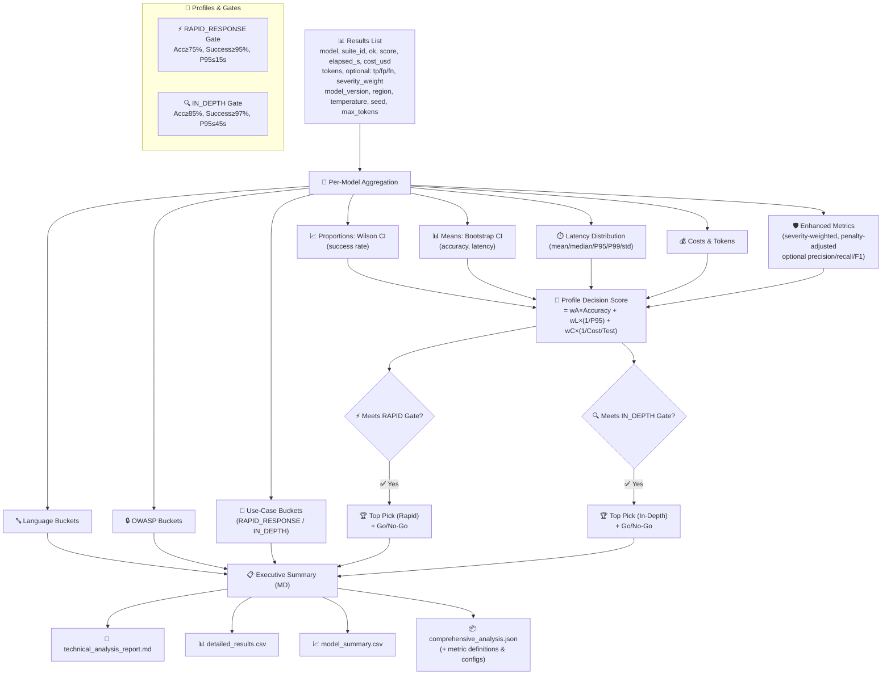

# 📖 `technical_reporter.py` — Design, Decisions & How-To

## Quick Summary

**Goal:** Security-focused LLM benchmarking that supports both **time-sensitive** work (rapid vuln detection, PR reviews, AoC/malware triage) and **deep analysis** (whole codebase understanding, metrics, compliance).

**What you get:**

- ⚡ **Rapid Response** and 🔍 **In-Depth** profiles with **profile-aware gates** and **Go/No-Go** calls
- 📊 **Statistical rigor**: Wilson/Bootstrap CIs, sample-size adequacy checks
- 🛡️ **Security-aware scoring**: precision/recall/F1 (if TP/FP/FN present), severity weighting, penalty-adjusted effectiveness
- 🧪 **Reproducibility**: version/region/temp/seed/max_tokens capture, audit-ready CSV/JSON
- 🧭 Actionable **top-pick model** per profile based on accuracy, latency, and cost

---

## Why Two Profiles?

### RAPID_RESPONSE (time-sensitive)

- **Use cases:** PR reviews, rapid vuln checks, assessment of compromise, malware/suspicious behavior triage
- **Gate:** Accuracy ≥ **75%**, Success ≥ **95%**, **P95 ≤ 15s**
- **Decision weights:** Accuracy **0.50**, Latency **0.35**, Cost **0.15**

### IN_DEPTH (deliberate)

- **Use cases:** Full repo analysis, systems understanding, metrics & measurements, compliance reviews
- **Gate:** Accuracy ≥ **85%**, Success ≥ **97%**, **P95 ≤ 45s**
- **Decision weights:** Accuracy **0.70**, Latency **0.10**, Cost **0.20**

> Rationale: Rapid workflows prioritize *fast, reliable triage*, while in-depth work tolerates latency to gain *higher accuracy and completeness*.

---

## 🧭 Decision Pipeline


## 📐 Metrics & Formulas

### Core

- **Success rate:** `successful_tests / total_tests`
  - **CI:** **Wilson 95%**
- **Accuracy (mean score):** mean of `score` over `ok==True`
  - **CI:** **Bootstrap 95%** (1,000 resamples; exact bounds when n<2)
- **Latency:** `elapsed_s` (end-to-end); report **mean, median, P95, P99, std**
- **Reliability score (0–1):** `0.7 * success_rate + 0.3 * (1 - std/mean_latency)` (clamped)

### Security-aware (if labels exist)

- **Precision/Recall/F1:** from `tp/fp/fn/tn` (optional)
- **Severity-weighted score:** mean of `score * severity_weight` where provided
- **Penalty-adjusted effectiveness:** quality/$ minus penalties for failures/timeouts

### Cost/Token

- **Cost per test:** `total_cost / n`
- **Cost per correct:** `total_cost / count(score≥0.8)`
- **Token efficiency:** `avg_accuracy / avg_tokens`

### Decision score (per profile)

```
decision = wA * avg_accuracy
         + wL * (1 / max(P95_latency, ε))
         + wC * (1 / max(cost_per_test, ε))
```

Weights `(wA, wL, wC)` come from the active profile.

---

## Gates & Sample Size

| Profile         | Accuracy | Success | P95 Latency | Recommended n/model |
| --------------- | -------- | ------- | ----------- | ------------------- |
| RAPID_RESPONSE  | ≥ 75%    | ≥ 95%   | ≤ 15s       | ≥ 30                |
| IN_DEPTH        | ≥ 85%    | ≥ 97%   | ≤ 45s       | ≥ 50                |

> If your `n` is below the recommendation, the report flags **low confidence** (wider CIs, less stable ranks).

---

## Categorization

- **Languages:** Python, JavaScript, Java, Go, Rust, C/C++, C#, PHP, Ruby, Haskell, General
- **OWASP:** A01 Broken Access Control, A02 Crypto Failures, A03 Injection (+XSS), A08 Integrity Failures, A10 SSRF, General
- **Use-Case Routing:**
  - Rapid signals in `suite_id`: `pr_`, `pull_request`, `diff`, `triage`, `aoc`, `incident`, `malware`, `suspicious`, `rapid`
  - In-Depth signals: `full_codebase`, `repository_map`, `metrics`, `architecture`, `in_depth`, `batch`
  - Default fallback: **Rapid**

---

## Outputs

- **`enhanced_executive_summary.md`** — profile-aware comparison + top pick + Go/No-Go
- **`technical_analysis_report.md`** — deep metrics: CIs, latency dist, costs
- **`detailed_results.csv`** — per test & model (auditable)
- **`model_summary.csv`** — rollup per model (CIs, P95, gates)
- **`comprehensive_analysis.json`** — complete structured export
  - Includes **metric definitions**, **profile thresholds**, **captured configs** (model version/region/temperature/seed/max_tokens)

---
## Usage Examples

### Rapid Response (PR Reviews / AoC triage)

```bash
python3 technical_reporter.py \
  --suite fast \
  --models gpt-4o-mini,gemini-2.5-flash-lite \
  --profile RAPID_RESPONSE
```

### In-Depth (Whole Codebase / Compliance)

```bash
python3 technical_reporter.py \
  --suite comprehensive \
  --models gpt-4o-mini,grok-3,grok-4 \
  --profile IN_DEPTH
```

### Minimal Viable, Quick Signal (low confidence)

```bash
python3 technical_reporter.py \
  --suite fast \
  --models gpt-4o-mini \
  --profile RAPID_RESPONSE \
  --min-samples 5
```

---

## Quality vs Speed Trade-offs

**You keep:**
- ✅ Executive summaries & engineering reports
- ✅ Security-aware scoring (if labels provided)
- ✅ CI-based rigor & reproducibility
- ✅ CSV/JSON exports for BI pipelines

**You trade:**
- ⚠️ Higher n → longer runs (but more reliable)
- ⚠️ Rapid profile uses tighter P95 targets (may reject slower, accurate models)
- ⚠️ In-Depth favors accuracy over speed (may cost more per test)

---

## Reproducibility & Governance

- Capture (when available): `model_version`, `region`, `temperature`, `seed`, `max_tokens`
- Record **run date**, **profile**, **gates**, **definitions** in JSON
- Use consistent seeds/temps for comparable runs
- Run **weekly canaries** to detect drift in accuracy/latency

---

## Data Model (Expected Fields)

**Required (or defaulted):**

- `model`, `suite_id`, `ok` (bool), `score` (0..1), `elapsed_s` (float),
- `cost_usd` (float), `input_tokens`, `output_tokens`, `total_tokens`

**Optional (enable richer security metrics):**

- `tp`, `fp`, `fn`, `tn` (ints)
- `severity_weight` (float)
- `model_version`, `region`, `temperature`, `seed`, `max_tokens`

---

## Methodology Notes

- **Success** = non-error, schema-valid response
- **Accuracy** = normalized score [0..1]; if labels exist, prefer precision/recall/F1 in JSON analysis
- **Latency** = end-to-end (client perspective)
- **CIs**:
  - Proportions → **Wilson 95%**
  - Means → **Bootstrap 95%** (1,000 resamples; exact bounds when n<2)
- **Throughput** reported as **theoretical per worker** (= 3600 / mean latency)

---

## FAQ

**Q: A model has great accuracy but fails Rapid gate. Why?**
A: Rapid has **strict P95 latency** (≤15s). Use **In-Depth** profile, or optimize prompts/caching.

**Q: No labels for TP/FP/FN. What do we lose?**
A: Precision/recall/F1 & severity-weighted scoring won't appear, but accuracy, CIs, and gates still work.

**Q: Different results week-to-week?**
A: LLMs drift. Use captured configs + canary runs; compare CIs, not just point estimates.

---

## Usage Scenarios Matrix

| Use Case | Recommended Profile | Model Type | Key Gate Focus |
|----------|-------------------|------------|---------------|
| PR Review | RAPID_RESPONSE | Fast models | P95 ≤ 15s |
| Malware Triage | RAPID_RESPONSE | Balanced speed/accuracy | Success ≥ 95% |
| AoC Analysis | RAPID_RESPONSE | Security-tuned models | Accuracy ≥ 75% |
| Full Repo Analysis | IN_DEPTH | High-accuracy models | Accuracy ≥ 85% |
| Compliance Review | IN_DEPTH | Thorough, consistent models | Success ≥ 97% |
| Architecture Review | IN_DEPTH | Code-understanding models | P95 ≤ 45s |

---

## Built by the Rapticore Security Research Team

Designed for real-world security ops: **rapid triage** when seconds matter and **deep analysis** when correctness is paramount.